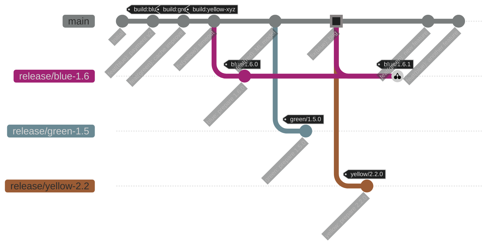

# Independent Microservice Release Management

> Complete guide for trunk-based development with independent service releases, GitOps, and feature flags

## Table of Contents

- [Overview](#overview)
- [Core Principles](#core-principles)
- [Architecture](#architecture)
- [Workflow](#workflow)
- [Manifest System](#manifest-system)

---

## Overview

This system enables **independent release cycles** for microservices in a monorepo, using:

- **Trunk-Based Development**: All development on `main` branch
- **Independent Versioning**: Each service has its own version and release schedule
- **Immutable Artifacts**: Build once, promote through environments
- **GitOps**: Environment state tracked in Git manifests
- **Feature Flags**: Decouple deployment from feature activation

### Key Goals

✅ **Fast to understand**: Single source of truth in manifest files  
✅ **Simple to use**: Automated DEV, manual STG/PRD with clear workflows  
✅ **Reproducible**: Exact artifact promoted through all environments  
✅ **Single source of truth**: Git manifests + tags = complete deployment state  
✅ **Version visibility**: Know exactly what's deployed in each environment

---

## Core Principles

### 1. Independent Service Releases

**Each service releases at its own pace:**

```yaml
# Production can have completely different versions
production:
  blue:    version: "1.6.1"  deployed: "2025-01-20"  ← Latest
  green:   version: "1.4.8"  deployed: "2025-01-10"  ← Stable, no changes needed
  yellow:  version: "2.2.0"  deployed: "2025-01-22"  ← Recent update
  red:     version: "3.0.8"  deployed: "2024-12-15"  ← Very stable, quarterly releases
```

### 2. Build Once, Deploy Many

```
main → Build image (sha-abc123)
         ↓
    Promote DEV (sha-abc123)     ← Same artifact
         ↓
    Promote STG (sha-abc123)     ← Same artifact
         ↓
    Promote PRD (sha-abc123)     ← Same artifact
```

### 3. Environment Progression

```
DEV (automatic)  →  STG (manual)  →  PRD (manual + approval)
```

### 4. GitOps Branches Keep History Clean

```
main                          ← Clean development history
release/blue-1.6              ← Long-lived release branches per service
gitops/dev-auto-update        ← DEV manifest updates (auto)
gitops/staging-releases       ← STG manifest updates (manual)
gitops/production-releases    ← PRD manifest updates (manual + approval)
```

---

## Architecture

```
┌─────────────────────────────────────────────────────────────────┐
│                         Git Repository                          │
│                                                                 │
│  main branch           release/blue-1.6       gitops/*         │
│  ─────────────         ───────────────        ──────────       │
│  projects/blue/        (long-lived)           dev.yaml         │
│  projects/green/       receives patches       staging.yaml     │
│  projects/yellow/                             production.yaml  │
│  projects/red/                                                 │
│                                                                │
│  [Commit] ──────┐                                              │
└─────────────────┼──────────────────────────────────────────────┘
                  │
                  ▼
         ┌────────────────┐
         │   CI Pipeline   │ Build image ONCE
         │  (GitHub Actions)│ sha-abc123
         └────────────────┘
                  │
                  ├─────────────┬─────────────┬──────────────┐
                  ▼ (auto)      ▼ (manual)    ▼ (manual+approval)
           ┌──────────┐   ┌──────────┐   ┌──────────────┐
           │   DEV    │   │   STG    │   │     PRD      │
           │ Manifest │   │ Manifest │   │   Manifest   │
           └──────────┘   └──────────┘   └──────────────┘
                  │              │               │
                  ▼              ▼               ▼
           ┌──────────┐   ┌──────────┐   ┌──────────────┐
           │ ArgoCD   │   │ ArgoCD   │   │   ArgoCD     │
           │  Reads   │   │  Reads   │   │   Reads      │
           └──────────┘   └──────────┘   └──────────────┘
                  │              │               │
                  ▼              ▼               ▼
           ┌──────────┐   ┌──────────┐   ┌──────────────┐
           │K8s DEV   │   │K8s STG   │   │  K8s PRD     │
           │Cluster   │   │Cluster   │   │  Cluster     │
           └──────────┘   └──────────┘   └──────────────┘
```

---

## Workflow

### Complete Release Flow



### Daily Development Flow

```bash
# Developer working on blue service
cd projects/blue/
git checkout main
git pull

# Make changes
vim src/payment.js
git add .
git commit -m "feat(blue): add new payment method"
git push origin main

# CI automatically:
# 1. Detects blue changed
# 2. Builds image: registry.example.com/blue:sha-abc123
# 3. Tags for DEV: registry.example.com/blue:dev
# 4. Updates gitops/dev-auto-update:release-manifests/dev.yaml
# 5. ArgoCD syncs to DEV cluster within 3 minutes

# Developer verifies in DEV
# If good, proceed to staging promotion...
```

### Promotion to Staging

```bash
# Manual promotion via GitHub Actions UI
# Actions → "Promote to Staging" → Run workflow

# Inputs:
#   service: blue
#   version: 1.6.0
#   source_sha: (leave empty to auto-detect from DEV)

# Workflow:
# 1. Gets current DEV image SHA for blue
# 2. Creates/updates release branch: release/blue-1.6
# 3. Creates tag: blue/1.6.0
# 4. Retags image: sha-abc123 → 1.6.0 (NO REBUILD!)
# 5. Updates gitops/staging-releases:release-manifests/staging.yaml
# 6. ArgoCD syncs to STG cluster
# 7. Notifies team in Microsoft Teams
```

### Promotion to Production

```bash
# Manual promotion with approval gate
# Actions → "Promote to Production" → Run workflow

# Inputs:
#   service: blue
#   version: 1.6.0

# Workflow:
# 1. Validates version exists in staging
# 2. Checks staging deployment age (warns if < 24h)
# 3. Waits for approval from 2 reviewers
# 4. Retags image: sha-abc123 → 1.6.0, prd
# 5. Updates gitops/production-releases:release-manifests/production.yaml
# 6. Creates milestone tag: release-prd-20250120
# 7. ArgoCD syncs to PRD cluster
# 8. Notifies team in Microsoft Teams
```

### Hotfix Flow

```bash
# Bug found in production (blue 1.6.0)

# 1. Fix on main
git checkout main
git commit -m "fix(blue): critical payment bug"
git push

# 2. Cherry-pick to release branch
git checkout release/blue-1.6
git cherry-pick <commit-hash>
git tag blue/1.6.1
git push origin release/blue-1.6 --tags

# 3. Promote to staging
gh workflow run promote-to-staging.yaml \
  -f service=blue \
  -f version=1.6.1

# 4. Test in staging, then promote to production
gh workflow run promote-to-production.yaml \
  -f service=blue \
  -f version=1.6.1
```

---

## Manifest System

### Manifest Structure

The manifest is the **single source of truth** for what's deployed in each environment.

```yaml
# release-manifests/production.yaml (on gitops/production-releases branch)
environment: production

services:
  blue:
    version: "1.6.1"
  green:
    version: "1.4.8"
  yellow:
    version: "2.2.0"
  red:
    version: "3.0.8"
```

### Manifest Updates

Manifests are **automatically updated by CI/CD** (never manually edited):

- **DEV**: Updated on every merge to `main` (for changed services)
- **STG**: Updated by manual promotion workflow
- **PRD**: Updated by manual promotion workflow with approval

### Deployment Flow

```
1. Manifest Updated (gitops/production-releases)
   └─> release-manifests/production.yaml: blue version = 1.6.1

2. CI Updates Kustomize
   └─> k8s/overlays/production/kustomization.yaml: blue newTag = sha-abc123

3. ArgoCD Detects Change
   └─> Polls Git repository every 3 minutes

4. ArgoCD Syncs
   └─> Applies Kubernetes manifests to cluster

5. Kubernetes Deploys
   └─> Rolling update of blue pods with new image
```
---

## Summary

### Key Principles

1. **Independent Releases**: Each service (blue, green, yellow, red) releases at its own pace
2. **Immutable Artifacts**: Build image once, promote through environments (no rebuilds)
3. **Single Source of Truth**: Git manifests show exact deployment state
4. **Clean History**: GitOps branches keep manifest updates separate from dev history
5. **Feature Flags**: Deploy code ≠ activate features (gradual rollouts, instant rollback)

### Environment Flow

```
DEV (automatic on merge to main)
  ↓
STG (manual promotion via GitHub Actions)
  ↓
PRD (manual promotion with approval gates)
```

**Remember**: The goal is **independent service releases** with complete visibility and reproducibility. Each service moves at its own pace, with feature flags coordinating cross-service changes when needed.
